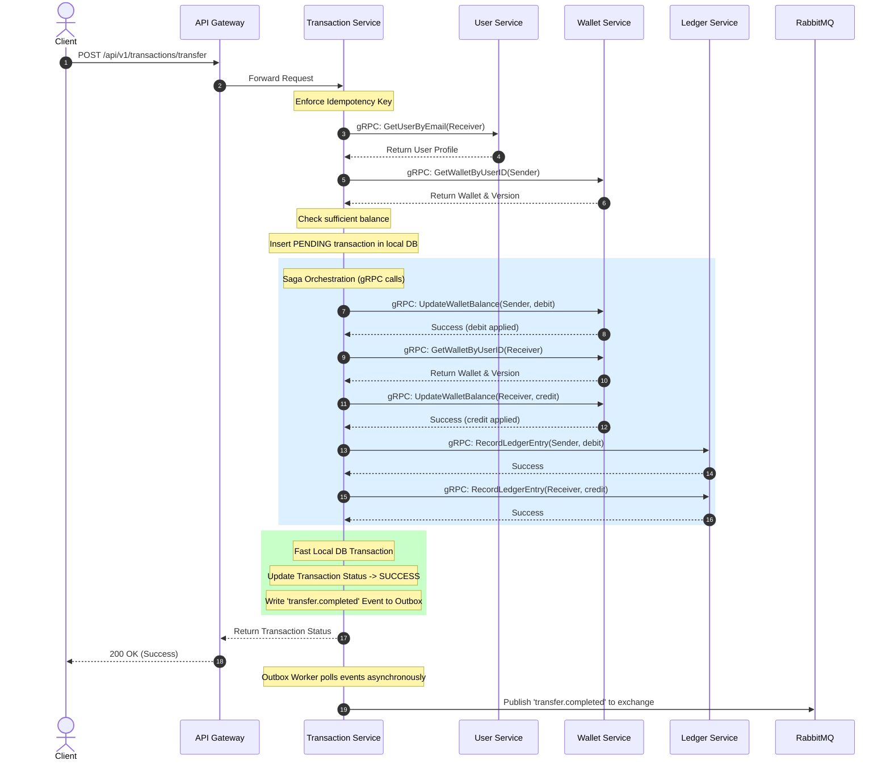
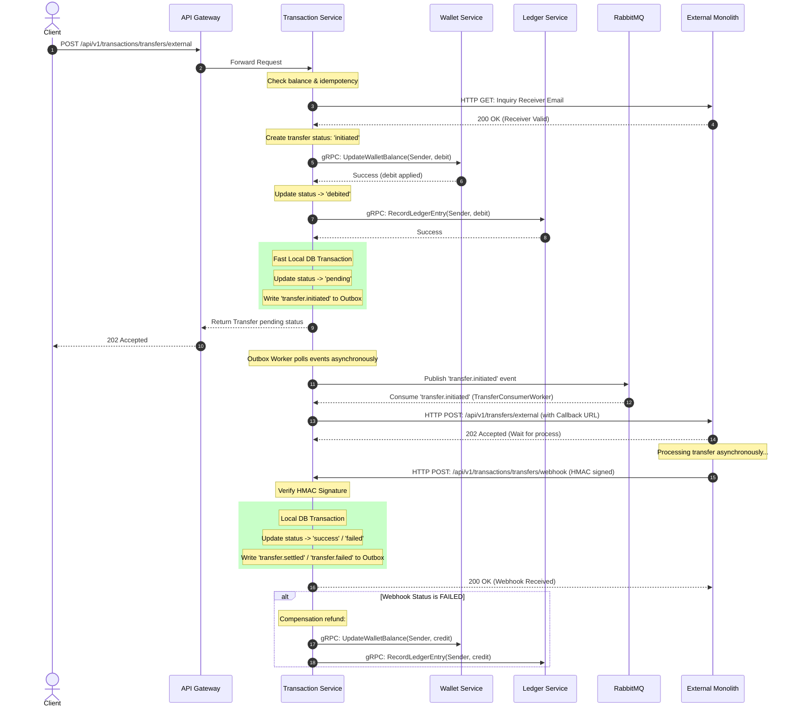
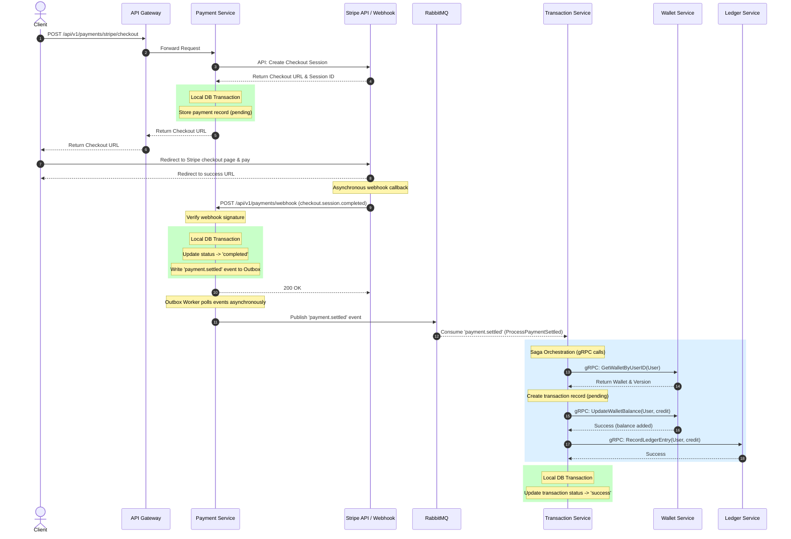

# GoWallet

A digital wallet project demonstrating the transition from a modular monolith to a distributed microservices architecture using Go, gRPC, and RabbitMQ.

GoWallet is an educational codebase designed to demonstrate the transition of a backend system from a modular monolith to a distributed microservices environment. It implements standard architectural patterns for financial transactions, including double-entry ledger entries, distributed saga orchestration, event-driven processes, polyglot persistence, and operational scheduling.

The repository contains two implementations:

- `monolith/` - A modular monolith version with clean domain boundaries and unit tests.
- `microservices/` - A distributed version with API Gateway, gRPC service-to-service calls, RabbitMQ events, transactional outbox workers, audit logging, object storage archival, and Docker Compose orchestration.

---

## 🎯 Key Learning Highlights

### **Architectural Evolution Journey**
- **Monolith → Microservices Migration Path**: Both implementations co-exist, making the decomposition strategy explicit and demonstrating migration steps.
- **Domain Boundaries**: Each service owns its data and business logic with clear gRPC/HTTP API contracts.
- **Distributed Systems Patterns**: Practical implementations of patterns commonly used in financial and distributed applications.

### **Distributed Systems Design**

#### **Transactional Outbox Pattern**
Event publishing is coordinated with database transactions to prevent issues arising from partial failures (dual-write problem). Every critical event (payments, transfers, notifications) is recorded in an outbox table within the same database transaction, then published asynchronously to RabbitMQ by dedicated workers with automatic retry logic.

#### **Saga Pattern with Compensation**
Multi-step wallet transfers across microservices use saga orchestration with manual rollback (compensation) logic. If a downstream service fails mid-transaction, the system executes compensating operations to restore consistency.

#### **Immutable Ledger Audit Trail**
Financial transactions create immutable ledger entries. Balance reconciliation jobs verify ledger-derived balances against wallet records to detect anomalies.

#### **Idempotency Guarantees**
Payment webhooks, external transfer callbacks, and critical mutations utilize idempotency keys to handle network retries and duplicate messages safely.

### **Polyglot Persistence Strategy**
- **MySQL**: Transactional data (users, wallets, ledger, transactions).
- **Redis**: Token blacklist, session management, rate limiting, and caching.
- **MongoDB**: Audit logs for schema flexibility.
- **MinIO (S3-compatible)**: Avatar storage and outbox event archival.

### **Service Communication Architecture**

#### **gRPC Service Mesh**
Type-safe, high-performance inter-service communication using Protocol Buffers. Services expose internal APIs for:
- User lookup and validation
- Wallet balance updates
- Ledger record creation
- Auth token cleanup
- Cross-service orchestration

#### **Event-Driven Messaging**
RabbitMQ exchanges and queues featuring:
- Topic-based routing for payment, transfer, audit, and notification events.
- Dead Letter Queues (DLQ) for handling unprocessable messages.
- Consumer retry policies with exponential backoff.
- Durable message persistence.

### **Financial Domain Modeling**
- **Double-Entry Accounting**: Ledger entries track money movements (debits and credits) corresponding to every wallet mutation.
- **Decimal-Safe Money Handling**: All monetary values use arbitrary-precision decimal types to prevent floating-point rounding errors.
- **Compensation & Rollback Logic**: Reversal steps restore consistent states when multi-step processes fail.

### **Third-Party Integration Patterns**
- **Stripe Payment Processing**: Checkout session creation, signature validation for webhooks, and a pipeline to process top-ups upon payment settlement.
- **External Wallet Provider Integration**: User inquiry API, external transfer initiation, HMAC-signed callback verification, and state transitions from pending to settled.

### **Operational Automation**
- **Automated Maintenance Jobs**: Scheduler service runs cron-orchestrated jobs for expired OTP cleanup, stale refresh token pruning, daily balance reconciliation, daily transaction reports, and outbox archival.
- **Object Storage Lifecycle**: Completed outbox events are archived to MinIO with date-partitioned paths (`/outbox/{service}/{date}/{uuid}.json`) before deletion from operational databases.
- **Observability**: Health check endpoints, structured logging, RabbitMQ management UI, MailHog for local email testing, and Swagger/OpenAPI documentation.

### **Security Implementation**
- **JWT Access & Refresh Tokens**: Short-lived access tokens with secure refresh rotation.
- **Redis Token Blacklist**: Immediate token revocation on logout.
- **Google OAuth Integration**: Social login with profile synchronization.
- **Role-Based Access Control (RBAC)**: Admin-only routes enforced via middleware.
- **API Key Authentication**: Service-to-service authentication for internal APIs.
- **Rate Limiting**: Request throttling per client.
- **HMAC Webhook Verification**: Cryptographic validation of external callbacks and Stripe webhooks.
- **Input Validation**: Request validation with structured error responses.

---

## 🏗️ Architecture Overview

```text
                          ┌─────────────────┐
                          │   API Gateway   │
                          │   :8080         │
                          │   + Swagger UI  │
                          └────────┬────────┘
                                   │
                    ┌──────────────┼──────────────┐
                    │              │              │
         ┏━━━━━━━━━━▼━━━━━━━━━┓   │   ┏━━━━━━━━▼━━━━━━━┓
         ┃   Auth Service    ┃   │   ┃  User Service   ┃
         ┃   JWT + OAuth     ┃   │   ┃  Profile + KYC  ┃
         ┗━━━━━━━━━┬━━━━━━━━━┛   │   ┗━━━━━━━━┬━━━━━━━━┛
                   │              │            │
                   │   gRPC      │            │ gRPC
                   │              │            │
         ┏━━━━━━━━━▼━━━━━━━━━┓   │   ┏━━━━━━━▼━━━━━━━━━┓
         ┃  Wallet Service   ┃◄──┼──►┃ Ledger Service  ┃
         ┃  Balance + CRUD   ┃   │   ┃ Audit Trail     ┃
         ┗━━━━━━━━━┬━━━━━━━━━┛   │   ┗━━━━━━━━━━━━━━━━━┛
                   │              │
                   │              │
         ┏━━━━━━━━━▼━━━━━━━━━━━━━▼━━━━━━━━━━━┓
         ┃      Transaction Service          ┃
         ┃   Transfers + External Wallet     ┃
         ┗━━━━━━━━━┬━━━━━━━━━━━━━┬━━━━━━━━━━━┛
                   │              │
              RabbitMQ       RabbitMQ
                   │              │
         ┏━━━━━━━━━▼━━━━━━━━┓    │
         ┃  Payment Service ┃    │
         ┃  Stripe + Outbox ┃    │
         ┗━━━━━━━━━┬━━━━━━━━┛    │
                   │              │
                Stripe        ┏━━━▼━━━━━━━━━━━━━━━━┓
              Webhooks        ┃  Audit Service     ┃
                              ┃  MongoDB Events    ┃
                              ┗━━━━━━━━━━━━━━━━━━━━┛
                              
         ┏━━━━━━━━━━━━━━━━━━━━━━━━━━━━━━━━━━━━━━━━┓
         ┃         Notification Service           ┃
         ┃      RabbitMQ Consumer + SMTP          ┃
         ┗━━━━━━━━━━━━━━━━━━━━━━━━━━━━━━━━━━━━━━━━┛

         ┏━━━━━━━━━━━━━━━━━━━━━━━━━━━━━━━━━━━━━━━━┓
         ┃         Scheduler Service              ┃
         ┃   Cron Jobs + Cleanup + Archival       ┃
         ┗━━━━━━━━━━━━━━━━━━━━━━━━━━━━━━━━━━━━━━━━┛
```

---

## 🔄 Core Workflows & Diagrams

### 1. Internal Wallet-to-Wallet Transfer Flow (Saga Pattern)
This workflow coordinates balance mutations and ledger entries across `transaction-service`, `user-service`, `wallet-service`, and `ledger-service` using gRPC. If any step fails, compensation logic is executed to rollback prior actions.



### 2. External Wallet Transfer Flow (Monolith Integration)
This workflow handles outbound transfers from a GoWallet user to an external provider (represented here by the modular monolith). The transaction status transitions from `initiated` to `debited`, then `pending` while waiting for an HMAC-signed status callback webhook.



### 3. Stripe-Based Wallet Top-Up Flow
This workflow details adding funds using the Stripe API. It coordinates webhook delivery with the transaction outbox and gRPC-driven balance mutations.



---

## 📦 Microservices Breakdown

| Service | Core Responsibility | Technology Highlights |
|---------|---------------------|----------------------|
| **api-gateway** | Public HTTP entry point | Reverse proxy routing, Swagger docs, JWT middleware |
| **auth-service** | Identity & access management | JWT issuance, refresh rotation, Google OAuth, Redis blacklist |
| **user-service** | User lifecycle | Profile CRUD, email verification OTP, avatar → MinIO upload |
| **wallet-service** | Wallet operations | Balance management, reconciliation endpoints |
| **ledger-service** | Financial audit trail | Double-entry ledger, immutable records, balance derivation |
| **transaction-service** | Money movement | Internal transfers with saga compensation, external wallet integration |
| **payment-service** | Payment processing | Stripe checkout + webhooks, transactional outbox pattern |
| **notification-service** | Event-driven alerts | RabbitMQ consumer, SMTP delivery, MailHog integration |
| **audit-service** | Compliance logging | MongoDB audit consumer, event storage |
| **scheduler-service** | Operational automation | Cron orchestration, cleanup jobs, MinIO archival |
| **shared** | Platform utilities | Config, DB, middleware, JWT, HMAC, RabbitMQ helpers, MinIO client |

---

## 🛠️ Technology Stack

| Layer | Technologies |
|-------|-------------|
| **Language** | Go 1.21+ |
| **HTTP Framework** | Gin (high-performance routing) |
| **RPC** | gRPC + Protocol Buffers |
| **Relational DB** | MySQL 8.0 (transactional data) |
| **Cache/Session** | Redis 7.0 (token blacklist, rate limiting) |
| **Document Store** | MongoDB 6.0 (audit logs) |
| **Message Broker** | RabbitMQ 3.12 (event bus) |
| **Object Storage** | MinIO (S3-compatible) |
| **Payment Gateway** | Stripe API |
| **API Documentation** | Swagger/OpenAPI |
| **Orchestration** | Docker Compose |
| **Testing** | Go test, sqlmock, redismock, bufconn |

---

## 🚀 Quick Start

### Prerequisites
- Docker & Docker Compose
- Go 1.21+

### Launch Full Microservices Stack

```bash
cd microservices
cp .env.example .env
docker compose up --build
```

**Service Endpoints:**
- API Gateway: http://localhost:8080
- Swagger UI: http://localhost:8080/swagger/index.html
- RabbitMQ Management: http://localhost:15672 (guest/guest)
- MailHog UI: http://localhost:8025
- MinIO Console: http://localhost:9001 (minioadmin/minioadmin)

### Run Tests

**Monolith:**
```bash
cd monolith
go test ./... -v -cover
```

**Microservices:**
```bash
cd microservices
go test ./... -v -cover
```

---

## 📡 API Overview

The API Gateway exposes unified `/api/v1` routes:

| Endpoint | Service | Capabilities |
|----------|---------|-------------|
| `/auth/*` | auth-service | Login, refresh, logout, OAuth |
| `/users/*` | user-service | Registration, profile, avatar upload, verification |
| `/wallets/*` | wallet-service | Wallet CRUD, balance queries, reconciliation |
| `/ledger/*` | ledger-service | Ledger entries, audit trail queries |
| `/transactions/*` | transaction-service | Internal transfers, external wallet flows, history |
| `/payments/*` | payment-service | Stripe checkout, payment history |

Full API specs are available at `/swagger/index.html` when running.

---

## 💡 Key Implementation Highlights

### **Transactional Outbox Implementation**
```go
// Atomic write: business entity + outbox event
tx.Begin()
tx.Create(&payment)
tx.Create(&OutboxEvent{Payload: paymentEvent})
tx.Commit()

// Background worker polls outbox -> publishes to RabbitMQ -> marks processed
```

### **Saga Compensation Pattern**
```go
// Multi-step transfer with rollback
DebitSenderWallet()  // Step 1
if err := CreditReceiverWallet(); err != nil {
    CompensateDebit()  // Rollback step 1
    return err
}
RecordLedgerEntries()  // Step 3
```

### **Idempotency Key Handling**
```go
// Prevent duplicate webhook processing
if ExistsInIdempotencyCache(webhookID) {
    return StatusOK  // Already processed
}
ProcessWebhook()
CacheIdempotencyKey(webhookID, 24*time.Hour)
```

### **gRPC Circuit Breaker**
```go
// Resilient service-to-service calls
ctx, cancel := context.WithTimeout(context.Background(), 5*time.Second)
defer cancel()
response, err := grpcClient.UpdateBalance(ctx, request)
```

---

## 📂 Repository Structure

```text
.
├── monolith/                  # Modular monolith implementation
│   ├── cmd/                   # Application entry point
│   ├── db/migrations/         # SQL schema migrations
│   └── internal/              # Domain logic (auth, user, wallet, etc.)
│
└── microservices/             # Distributed architecture
    ├── api-gateway/           # Public API surface + Swagger
    ├── auth-service/          # Identity & token management
    ├── user-service/          # User profile & verification
    ├── wallet-service/        # Wallet operations
    ├── ledger-service/        # Financial audit trail
    ├── transaction-service/   # Money movement orchestration
    ├── payment-service/       # Stripe integration + outbox
    ├── notification-service/  # Event-driven alerts
    ├── audit-service/         # Compliance logging
    ├── scheduler-service/     # Operational automation
    ├── shared/                # Common utilities & middleware
    └── proto/                 # gRPC service definitions
```

---

## 🎓 Learning Path for Code Review

**For architecture evaluation:**
1. Start with `docker-compose.yml` to understand the topology.
2. Review `proto/` definitions to inspect service contracts.
3. Inspect `shared/` package for shared middleware and helpers.

**For distributed systems patterns:**
1. `payment-service/outbox/` → Transactional outbox implementation.
2. `transaction-service/saga/` → Saga compensation logic.
3. `shared/rabbitmq/` → Event publishing with retry mechanisms.

**For domain-driven design:**
1. `ledger-service/` → Financial audit trail modeling.
2. `transaction-service/` → Core orchestration & state machines.
3. `wallet-service/` → Balance consistency guarantees.

**For operational features:**
1. `scheduler-service/` → Automated maintenance jobs.
2. `shared/storage/` → MinIO archival lifecycle.
3. `shared/middleware/` → Security & observability cross-cuts.

---

## 🔒 Security Considerations

- **Authentication**: JWT-based authentication with Redis-backed blacklist for immediate token revocation.
- **Authorization**: Role-based access control (RBAC) middleware for admin routes.
- **Webhook Security**: HMAC signature verification for Stripe and external callbacks.
- **Input Validation**: Request validation with structured errors.
- **Rate Limiting**: Request throttling per client.
- **CORS Policies**: Cross-origin request restrictions.
- **Secrets Management**: Configuration via environment variables.
- **SQL Injection Protection**: Parameterized SQL queries.

---

## 🎯 Project Goals & Philosophy

This project is built to demonstrate:

1. **Practical Complexity**: Represents real-world domain challenges in transaction processing and data consistency.
2. **Architectural Trade-offs**: Illustrates when to use a monolith versus a microservices architecture.
3. **Common Design Patterns**: Applies industry-standard patterns such as Saga Orchestration, Transactional Outbox, and CQRS.
4. **Operational Automation**: Includes job scheduling, data archival, and log aggregation setup.
5. **Testing Strategy**: Multi-layer testing coverage spanning from repository up to handler layers.
6. **Clean Code**: Emphasizes maintainability, modularity, and clean separation of concerns.

---

## 📝 Status & Future Enhancements

**Current State:** Fully functional backend platform.

**Potential Extensions:**
- GraphQL gateway support.
- Distributed tracing integration with OpenTelemetry.
- Kubernetes deployment manifests.
- End-to-end integration test suite.
- Performance benchmarking suites.
- Multi-tenancy support.
- Blockchain settlement integration.

---

## 📄 License

This is a demonstration project. Use for learning and reference purposes.

---

*Built with Go, demonstrating distributed architectures and financial ledger systems.*
